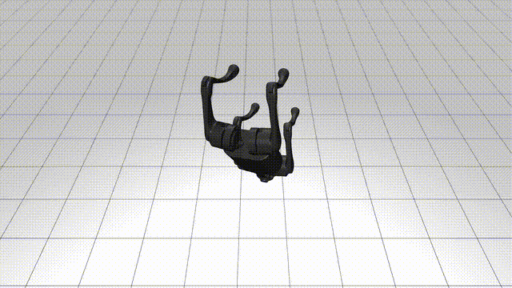

# SpaceDoggy

Course Final Project of *ROB-GY 7863 Plan, Learn, and Control Autonomous Space Robots*, instructed by Prof. Benjamin Riviere

This project studies robust quadrupedal landing strategies on granular terrain under reduced gravity with diverse initial poses. Proximal Policy Optimization (PPO) is employed to train the control policies.

- The [Granular Terrain Model](GranularModule/README.md) is built and tested with **Unitree Go2**

- Policy trainings are conducted with **Unitree Go1** in [MuJoCo Playground](https://github.com/google-deepmind/mujoco_playground/)
  - **Attitude Control Policy**

    

  - **Landing Control Policy**

    

## Collaborators
- [Yipeng Wang](https://github.com/Epon-Wang)
- [Zihan Liu](https://github.com/GuoZheXinDeGuang)


## Installation

```bash
conda create -n Doggy python=3.11
conda activate Doggy
```
Install JAX
```bash
pip install -U "jax[cuda12]"

# Test Installation, should print "gpu"
python -c "import jax; print(jax.default_backend())" 
```
Install MuJoCo Playground
```bash
cd SpaceDoggy
pip install -e ".[all]"

# Test Installation
python -c "import mujoco_playground"
```
Install rscope for interactive training visualization
```bash
pip install rscope
```

## Training

This project could be trained with two different implementations of **PPO** algorithm, logs and checkpoints are saved in `logs` directory

- To train with **[RSL-RL](https://github.com/leggedrobotics/rsl_rl)** (*Recommended* )

  ```bash
  python learning/train_rsl_rl.py \
  --env_name <task_name> \
  --use_wandb=True
  ```

- To train with **[Brax](https://github.com/google/brax)**

  ```bash
  python learning/train_jax_ppo.py \
  --env_name <task_name> \
  --use_wandb=True
  ```
- Supported Tasks
  | `<task_name>` | Task Description |
  |-------|-------------|
  |`Go1Reorientation`   |Zero-Gravity Attitude Control|
  |`Go1LandingFlat`     |Low-Gravity Landing Control on Flat Terrain|
  |`Go1LandingGranular` |Low-Gravity Landing Control on Granular Terrain|

## Evaluation

Render the behaviour from the resulting policy with top tracing camera

- Render a policy trained with **RSL-RL**

  > **[NOTE]** Please make sure the folder of the run to be evaluated is under the directory of `logs/rslrl-training-logs`

  ```bash
  python learning/train_rsl_rl.py \
  --env_name <task_name> \
  --play_only \
  --load_run_name <run_name> \
  --camera=top
  ```

- Render a policy trained with **Brax**

  ```bash
  python learning/train_jax_ppo.py \
  --env_name=<task_name> \
  --play_only=True \
  --load_checkpoint_path=path/to/run_name/checkpoints \
  --camera=top \
  --num_videos=1 \
  --episode_length=500
  ```

where `run_name` could be found at
- `Run name` printed in the real-time console of **RSL-RL**
- `Experiment Name` printed at the begining of the training of **Brax**

## Interactive Visualization

> **[NOTE]** This function is ONLY available for **Brax**

Interactively view trajectories throughout training

```bash
python learning/train_jax_ppo.py \
--env_name <task_name> \
--rscope_envs 16 \
--run_evals=False \
--deterministic_rscope=True
```

Alternatively, you can add `--load_checkpoint_path=...` to evaluate (and keep training) a trained policy

In a separate terminal
```bash
python -m rscope
```

## Citation

This project is built upon the codebase of MuJoCo Playground

```bibtex
@misc{mujoco_playground_2025,
  title = {MuJoCo Playground: An open-source framework for GPU-accelerated robot learning and sim-to-real transfer.},
  author = {Zakka, Kevin and Tabanpour, Baruch and Liao, Qiayuan and Haiderbhai, Mustafa and Holt, Samuel and Luo, Jing Yuan and Allshire, Arthur and Frey, Erik and Sreenath, Koushil and Kahrs, Lueder A. and Sferrazza, Carlo and Tassa, Yuval and Abbeel, Pieter},
  year = {2025},
  publisher = {GitHub},
  url = {https://github.com/google-deepmind/mujoco_playground}
}
```